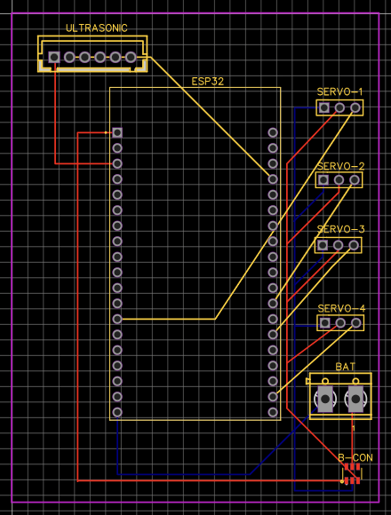
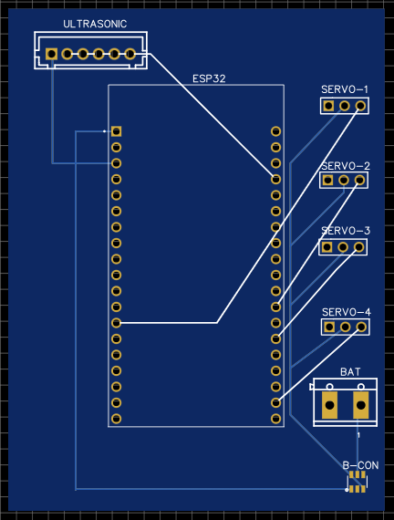
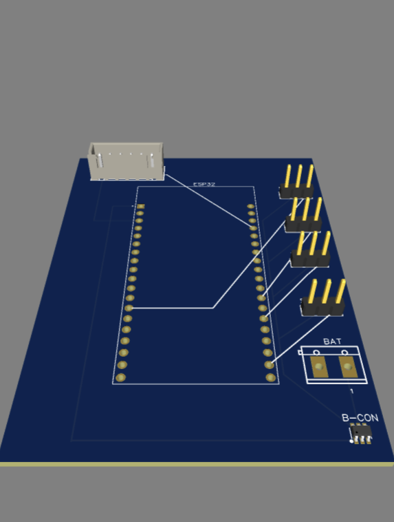

# Design-PCB-for-Robot 🤖⚡

## 📌 Project Overview
A custom PCB designed using EasyEDA for an intelligent robotics system powered by an **ESP32** microcontroller, integrated with a sound sensor, four servo motors, and an advanced power management stage.

---

  
  
  

---

## 🛠️ Step-by-Step Design Journey & Component Rationale

* **Step 1: Power Management Stage (MT3608 Boost Converter)** 🔋
  * *Component:* **MT3608 DC-DC Boost Converter**
  * *Reason:* Selected to take the input voltage from the battery (e.g., 3.7V) and efficiently step it up to a stable 5V output required to power the servos and system components reliably.
* **Step 2: Microcontroller Unit (ESP32 DevKit)** 🧠
  * *Component:* **ESP32 Microcontroller**
  * *Reason:* Acts as the brain of the project, chosen for its robust processing power, built-in Wi-Fi/Bluetooth capabilities, and ample GPIO pins to manage sensors and multiple motors simultaneously.
* **Step 3: Sound Sensor Integration** 🎤
  * *Component:* **Sound Sensor Module (Ultrasonic footprint mapped)**
  * *Reason:* Added to detect environmental audio triggers and input data signals directly into the ESP32 via designated GPIO pins (e.g., GPIO 4) for interactive robotic responses.
* **Step 4: Servo Motors Setup (4x Servos)** 🔄
  * *Component:* **4 Servo Motors**
  * *Reason:* Implemented for multi-joint articulation and mechanical movement, controlled via individual PWM GPIO pins (GPIO 12, 13, 14, and 27) while drawing stable power directly from the boosted 5V rail.
* **Step 5: Logical Routing & Two-Layer PCB Design** 🌐
  * *Concept:* **Double-Sided Routing (Top & Bottom Layers)**
  * *Reason:* Utilized a dual-layer strategy to cleanly separate power lines and signal traces without crossing conflicts:
    * **Top Layer (Red):** Dedicated to positive power distribution (VCC / 5V) and active signal paths.
    * **Bottom Layer (Blue):** Dedicated to the common ground (GND) plane to ensure signal integrity, reduce noise, and complete the circuit safely.

---

## 📸 Project Visualizations & Live Link
* **2D PCB Layout Preview:** [View 2D Design](https://via.placeholder.com/800x400.png?text=2D+PCB+Layout+Preview) 📐
* **3D Realistic Model Preview:** [View 3D Render](https://via.placeholder.com/800x400.png?text=3D+PCB+Model+Preview) 🕶️
* **Live EasyEDA Project:** [EasyEDA Workspace Link](https://easyeda.com/editor#id=9edfc41c80fc49a70f345ecf7f0dd99) 🔗
